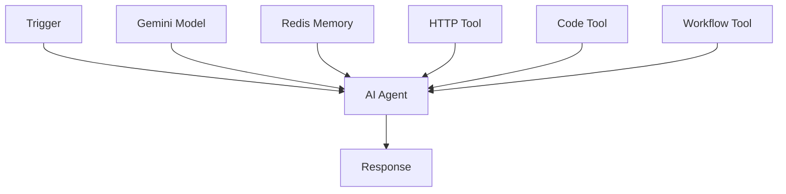

# 🚀 n8n - Intelligent Workflow Automation Platform

> **A modern, visual workflow automation platform powered by AI agents, featuring intelligent execution flows, modal integration, and extensible node-based architecture.**

[](LICENSE)
[](https://nodejs.org/)
[](https://www.typescriptlang.org/)
[](https://reactjs.org/)

## 📑 Table of Contents

- [🎯 Overview](#overview)
- [✨ Key Features](#key-features)
- [📖 User Guide](#user-guide)
  - [Getting Started](#getting-started)
  - [Creating Your First Workflow](#creating-your-first-workflow)
  - [Node Types & Configuration](#node-types--configuration)
  - [AI Agent Setup](#ai-agent-setup)
  - [Template System](#template-system)
- [🔧 Developer Guide](#developer-guide)
  - [Architecture Overview](#architecture-overview)
  - [Data Schema](#data-schema)
  - [API Reference](#api-reference)
  - [Extending the Platform](#extending-the-platform)
- [🚀 Quick Start](#quick-start)
- [📚 Examples](#examples)
- [🤝 Contributing](#contributing)

---

## 🎯 Overview

**n8n** is a comprehensive workflow automation platform that combines the simplicity of visual programming with the power of artificial intelligence. Built on a modern tech stack featuring **React**, **Node.js**, **TypeScript**, and **LangChain**, it enables users to create sophisticated automation workflows through an intuitive drag-and-drop interface.

### Why n8n?

- **🧠 AI-Powered Intelligence**: Built-in AI agents using Google's Gemini models with tool integration
- **🎨 Visual Workflow Builder**: Intuitive drag-and-drop interface with real-time feedback
- **🔗 Extensive Integrations**: Email, Telegram, HTTP APIs, code execution, and workflow nesting
- **⚡ Real-time Execution**: Live workflow testing and debugging capabilities
- **🔐 Secure & Scalable**: User authentication, credential management, and MongoDB persistence
- **🛠 Developer-Friendly**: Extensible architecture with comprehensive APIs

---

## ✨ Key Features

### 🔄 **Workflow Automation**
- **Visual Flow Designer**: Create complex workflows using a node-based visual editor
- **Multiple Trigger Types**: Manual execution and webhook-based automation
- **Parallel Execution**: Intelligent batching and parallel node processing
- **Error Handling**: Comprehensive error reporting and recovery mechanisms

### 🤖 **AI Agent Integration**
- **LangChain Integration**: Advanced AI agents with tool-calling capabilities
- **Google Gemini Support**: State-of-the-art language model integration
- **Memory Management**: Redis-based conversation memory for context retention
- **Dynamic Tool System**: HTTP requests, code execution, and workflow nesting

### 🔌 **Rich Node Ecosystem**
- **Triggers**: Manual, Webhook
- **Actions**: Email, Telegram messaging
- **AI Components**: Intelligent agents, language models, memory systems
- **Tools**: HTTP requests, code execution, workflow orchestration

### 🎛 **Advanced Configuration**
- **Template Engine**: Dynamic content injection with `{{variable}}` syntax
- **Credential Management**: Secure storage and management of API keys and tokens
- **Environment Variables**: Flexible configuration management
- **Real-time Testing**: Live execution and debugging capabilities

---

## 📖 User Guide

### Getting Started

#### 1. **Installation & Setup**

```bash
# Clone the repository
git clone https://github.com/Gokulrx100/n8n.git
cd n8n

# Install dependencies
pnpm install

# Start development servers
pnpm dev
```

#### 2. **Environment Configuration**

Create environment files:

**Backend (`.env` in `apps/backend/`)**:
```env
# Database
MONGODB_URI=mongodb://localhost:27017/n8n
REDIS_URL=redis://localhost:6379

# Authentication
JWT_SECRET=your-super-secret-jwt-key

# AI Integration
GOOGLE_API_KEY=your-gemini-api-key

# Email Service
SMTP_HOST=smtp.gmail.com
SMTP_PORT=587
```

**Frontend (`.env` in `apps/frontend/`)**:
```env
VITE_BASE_API=http://localhost:3000/api
```

#### 3. **First Time Setup**

1. **Register Account**: Create your user account via the authentication interface
2. **Configure Credentials**: Set up your service credentials (email, Telegram, etc.)
3. **Create First Workflow**: Start with a simple manual trigger workflow

### Creating Your First Workflow

#### **Simple Email Notification Workflow**

1. **Add Manual Trigger**
   - Drag "Manual Trigger" from the sidebar
   - Configure payload data (optional)

2. **Add Email Action**
   - Drag "Email Action" from Actions section
   - Connect it to the Manual Trigger
   - Configure recipient, subject, and message

3. **Configure Credentials**
   - Create email credentials with your SMTP settings
   - Select credentials in the Email Action node

4. **Test Execution**
   - Click the play button on Manual Trigger
   - Monitor execution results in real-time

### Node Types & Configuration

#### **🚀 Triggers**

##### **Manual Trigger**
- **Purpose**: Start workflows manually with custom payload data
- **Configuration**:
  ```json
  {
    "label": "Start Process",
    "payload": "{\"user\": \"john\", \"action\": \"welcome\"}"
  }
  ```
- **Use Cases**: Testing, on-demand processes, user-initiated workflows

##### **Webhook Trigger**
- **Purpose**: HTTP endpoint automation with method and security options
- **Configuration**:
  ```json
  {
    "label": "API Webhook",
    "method": "POST",
    "path": "wh_1234567890_abcdef",
    "secret": "optional-security-token"
  }
  ```
- **Generated URL**: `http://your-domain/webhook/wh_1234567890_abcdef`
- **Use Cases**: External API integration, real-time notifications, third-party triggers

#### **📤 Actions**

##### **Email Action**
- **Purpose**: Send emails with dynamic content and template support
- **Configuration**:
  ```json
  {
    "credentialId": "email_credential_id",
    "to": "{{trigger.email}}",
    "subject": "Welcome {{trigger.name}}!",
    "body": "Hello {{trigger.name}}, welcome to our platform!"
  }
  ```
- **Features**: HTML support, template variables, credential management
- **Use Cases**: Notifications, alerts, automated communications

##### **Telegram Action**
- **Purpose**: Send messages to Telegram chats and channels
- **Configuration**:
  ```json
  {
    "credentialId": "telegram_credential_id",
    "chatId": "{{trigger.chatId}}",
    "message": "🚀 Process completed: {{trigger.status}}"
  }
  ```
- **Features**: HTML formatting, file attachments, chat management
- **Use Cases**: Instant notifications, bot responses, team alerts

#### **🤖 AI Components**

##### **AI Agent**
- **Purpose**: Intelligent task execution with tool integration and reasoning
- **Configuration**:
  ```json
  {
    "label": "Customer Support Agent",
    "systemPrompt": "You are a helpful customer support agent. Use available tools to assist users with their queries.",
    "temperature": 0.7
  }
  ```
- **Required Connections**:
  - **Model**: Gemini language model for reasoning
  - **Memory**: (Optional) Redis for conversation context
  - **Tools**: (Optional) HTTP, Code, or Workflow tools

##### **Gemini Model**
- **Purpose**: Google's advanced language model integration
- **Configuration**:
  ```json
  {
    "apiKey": "your-gemini-api-key",
    "model": "gemini-1.5-flash",
    "temperature": 0.3,
    "maxTokens": 2000
  }
  ```
- **Models Available**: `gemini-1.5-flash`, `gemini-1.5-pro`

##### **Redis Memory**
- **Purpose**: Conversation context and memory management
- **Configuration**:
  ```json
  {
    "sessionId": "session_1234567890",
    "maxHistory": 10
  }
  ```
- **Features**: Persistent conversations, context retention, session management

#### **🛠 Tools**

##### **HTTP Tool**
- **Purpose**: Make external API requests and fetch data
- **Configuration**:
  ```json
  {
    "label": "Weather API",
    "url": "https://api.weather.com/data",
    "method": "GET",
    "headers": "{\"Authorization\": \"Bearer token\"}"
  }
  ```
- **Use Cases**: API integration, data fetching, external service communication

##### **Code Tool**
- **Purpose**: Execute JavaScript and Python code dynamically
- **Configuration**:
  ```json
  {
    "label": "Data Processor",
    "language": "javascript",
    "code": "const result = input * 2; return result;"
  }
  ```
- **Supported Languages**: JavaScript, Python
- **Use Cases**: Data transformation, calculations, custom logic

##### **Workflow Tool**
- **Purpose**: Execute other workflows as nested processes
- **Configuration**:
  ```json
  {
    "label": "User Onboarding",
    "workflowId": "workflow_id_to_execute",
    "triggerData": "{\"user\": \"new_user\"}"
  }
  ```
- **Use Cases**: Modular workflows, complex process orchestration, reusable components

### AI Agent Setup

#### **Complete AI Agent Configuration**

1. **Create AI Agent Node**
   - Add AI Agent from the Actions section
   - Configure system prompt and behavior

2. **Connect Gemini Model**
   - Add Gemini Model node
   - Configure with your API key
   - Connect to AI Agent's "Model" input

3. **Add Memory (Optional)**
   - Add Redis Memory node for conversation context
   - Configure session ID for user identification
   - Connect to AI Agent's "Memory" input

4. **Connect Tools (Optional)**
   - Add HTTP Tool for external API access
   - Add Code Tool for computational tasks
   - Add Workflow Tool for complex orchestration
   - Connect multiple tools to AI Agent's "Tool" input

#### **AI Agent Execution Flow**



**Step-by-Step Execution**:
1. **Model Loading**: Instantiate Gemini LLM with configuration
2. **Tool Discovery**: Identify and initialize connected tools
3. **Memory Retrieval**: Load conversation history (if memory connected)
4. **Prompt Processing**: Apply system prompt with dynamic variables
5. **Agent Creation**: Build LangChain agent with tools and model
6. **Execution**: Process input and generate intelligent response
7. **Memory Storage**: Save conversation context (if memory connected)
8. **Result Return**: Provide structured output with metadata

### Template System

#### **Variable Injection**

The platform supports powerful template variables using `{{variable}}` syntax:

##### **Trigger Data Access**
```
{{trigger.email}}       // Direct trigger property
{{trigger.body.name}}   // Nested trigger property
{{trigger.message}}     // Common trigger content
```

##### **Node Output Reference**
```
{{nodeId.outputField}}  // Reference previous node output
{{email-123.messageId}} // Specific node result
{{ai-456.output}}       // AI agent response
```

##### **Template Examples**

**Email with Dynamic Content**:
```html
Subject: Welcome {{trigger.name}}!

Hello {{trigger.name}},

Your account has been created successfully.
Order ID: {{trigger.orderId}}
Status: {{payment-node.status}}

Best regards,
The Team
```

**Telegram Notification**:
```
🚀 Process Update

User: {{trigger.user}}
Status: {{processor.result}}
Time: {{trigger.timestamp}}
Details: {{analyzer.summary}}
```

---

## 🔧 Developer Guide

### Architecture Overview

#### **System Architecture**

```
┌─────────────────────────────────────────────────────────────┐
│                     Frontend (React)                        │
├─────────────────────────────────────────────────────────────┤
│ • React Flow Editor    • Node Components   • Hooks          │
│ • TypeScript           • Tailwind CSS     • State Mgmt      │
└─────────────────────────────────────────────────────────────┘
                                │
                                │ HTTP/REST API
                                │
┌─────────────────────────────────────────────────────────────┐
│                    Backend (Node.js)                        │
├─────────────────────────────────────────────────────────────┤
│ • Express.js Server    • Controllers      • Services        │
│ • TypeScript           • Auth Middleware  • Node Executors  │
│ • LangChain AI         • Execution Engine • Tool System     │
└─────────────────────────────────────────────────────────────┘
                                │
                    ┌───────────┼───────────┐
                    │           │           │
              ┌─────────┐ ┌─────────┐ ┌─────────┐
              │ MongoDB │ │  Redis  │ │External │
              │Database │ │ Memory  │ │APIs/AI  │
              └─────────┘ └─────────┘ └─────────┘
```

#### **Technology Stack**

**Frontend**:
- **React 19.1.1**: Modern UI library with hooks and concurrent features
- **@xyflow/react 12.8.4**: Advanced node-based visual editor
- **TypeScript 5.8.3**: Type-safe development
- **Tailwind CSS 4.1.13**: Utility-first styling
- **Vite 7.1.2**: Fast build tool and dev server

**Backend**:
- **Node.js 18+**: JavaScript runtime
- **Express.js 5.1.0**: Web application framework
- **TypeScript 5.9.2**: Type-safe backend development
- **Mongoose 8.18.1**: MongoDB object modeling
- **LangChain 0.3.34**: AI agent framework
- **@langchain/google-genai 0.2.18**: Gemini integration

**Infrastructure**:
- **MongoDB**: Primary database for workflows, users, credentials
- **Redis 5.8.2**: Memory management and caching
- **Turbo 2.5.6**: Monorepo build system
- **pnpm 9.0.0**: Package management

### Data Schema

#### **Core Models**

##### **User Model**
```typescript
interface IUser {
  email: string;          // Unique user identifier
  password: string;       // Bcrypt hashed password
  createdAt: Date;        // Account creation timestamp
  updatedAt: Date;        // Last modification timestamp
}
```

##### **Workflow Model**
```typescript
interface IWorkFlow {
  title: string;                    // Workflow display name
  enabled: boolean;                 // Execution state
  nodes: any[];                    // Visual flow nodes
  connections: Record<string, any>; // Node interconnections
  userId: ObjectId;                // Owner reference
  createdAt: Date;                 // Creation timestamp
  updatedAt: Date;                 // Last modification
}

interface WorkflowNode {
  id: string;                      // Unique node identifier
  type: string;                    // Node type (trigger, action, etc.)
  position: { x: number; y: number }; // Visual position
  data: Record<string, any>;       // Node configuration
}

interface Connection {
  id: string;                      // Connection identifier
  source: string;                  // Source node ID
  target: string;                  // Target node ID
  sourceHandle?: string;           // Source connection point
  targetHandle?: string;           // Target connection point
}
```

##### **Credential Model**
```typescript
interface ICredential {
  title: string;                   // Display name
  platform: string;               // Service type (email, telegram, etc.)
  data: Record<string, any>;       // Encrypted credential data
  userId: ObjectId;                // Owner reference
  createdAt: Date;                 // Creation timestamp
  updatedAt: Date;                 // Last modification
}
```

##### **Webhook Model**
```typescript
interface IWebhook {
  _id: ObjectId;                   // Unique webhook identifier
  title: string;                   // Webhook display name
  workflowId: ObjectId;           // Associated workflow
  nodeId: string;                 // Associated node ID
  method: string;                  // HTTP method (GET, POST, etc.)
  path: string;                    // Unique webhook path
  header?: Record<string, string>; // Expected headers
  secret?: string;                 // Optional security token
  createdAt: Date;                 // Creation timestamp
  updatedAt: Date;                 // Last modification
}
```

#### **Execution Context**

```typescript
interface ExecutionContext {
  triggerData: any;                      // Initial trigger payload
  nodeOutputs: Record<string, any>;      // Previous node results
  workflow: IWorkFlow;                   // Current workflow definition
}

interface ExecutionResult {
  executionId: string;                   // Unique execution identifier
  success: boolean;                      // Overall execution status
  results: NodeExecutionResult[];        // Individual node results
}

interface NodeExecutionResult {
  nodeId: string;                       // Node identifier
  nodeType: string;                     // Node type classification
  success: boolean;                     // Execution success state
  data: any;                           // Output data
  error?: string;                      // Error message (if failed)
}
```

### API Reference

#### **Authentication Endpoints**

```typescript
// User Registration
POST /api/auth/signup
{
  "email": "user@example.com",
  "password": "securepassword"
}

// User Login
POST /api/auth/signin
{
  "email": "user@example.com", 
  "password": "securepassword"
}
// Returns: { token: "jwt-token", user: {...} }
```

#### **Workflow Management**

```typescript
// Create Workflow
POST /api/workflows
Authorization: Bearer <token>
{
  "title": "My Workflow",
  "nodes": [...],
  "connections": {...},
  "enabled": true
}

// Get User Workflows
GET /api/workflows
Authorization: Bearer <token>

// Get Workflow by ID
GET /api/workflows/:id
Authorization: Bearer <token>

// Update Workflow
PUT /api/workflows/:id
Authorization: Bearer <token>
{
  "title": "Updated Workflow",
  "nodes": [...],
  "connections": {...}
}

// Delete Workflow  
DELETE /api/workflows/:id
Authorization: Bearer <token>
```

#### **Execution Endpoints**

```typescript
// Manual Execution
POST /api/execution/workflow/:workflowId
Authorization: Bearer <token>
{
  "triggerData": {
    "user": "john",
    "action": "process"
  }
}

// Webhook Execution (Public)
POST /webhook/:path
{
  "data": "webhook payload"
}
// Headers: { "secret": "webhook-secret" }
```

#### **Credential Management**

```typescript
// Create Credential
POST /api/credentials
Authorization: Bearer <token>
{
  "title": "Gmail SMTP",
  "platform": "email",
  "data": {
    "email": "sender@gmail.com",
    "appPassword": "app-specific-password"
  }
}

// Get User Credentials
GET /api/credentials
Authorization: Bearer <token>

// Update Credential
PUT /api/credentials/:id
Authorization: Bearer <token>
{
  "title": "Updated Credential",
  "platform": "email",
  "data": {...}
}

// Delete Credential
DELETE /api/credentials/:id
Authorization: Bearer <token>
```

### Extending the Platform

#### **Adding New Node Types**

##### **1. Frontend Node Component**

Create a new node component in `apps/frontend/src/nodes/`:

```tsx
// NewActionNode.tsx
import { Handle, Position } from "@xyflow/react";
import { YourIcon } from "lucide-react";

export default function NewActionNode({ data }: any) {
  return (
    <div className="flex items-center justify-center w-20 h-20 rounded-lg shadow-lg text-white bg-purple-600 border border-purple-500">
      <Handle
        type="target"
        position={Position.Left}
        id="input"
        style={{ background: "#7c3aed" }}
      />
      <Handle
        type="source" 
        position={Position.Right}
        id="output"
        style={{ background: "#7c3aed" }}
      />
      <div className="text-center">
        <YourIcon size={20} />
        <div className="text-xs">{data.label}</div>
      </div>
    </div>
  );
}
```

##### **2. Register Node Type**

Add to `apps/frontend/src/pages/Workflow.tsx`:

```tsx
import NewActionNode from "../nodes/Actions/NewActionNode";

const nodeTypes = {
  // ... existing nodes
  newAction: NewActionNode,
};
```

##### **3. Add to Toolbox**

Update `apps/frontend/src/components/workflow/ToolBoxSidebar.tsx`:

```tsx
{
  type: "newAction",
  label: "New Action", 
  description: "Description of new action",
  icon: <YourIcon size={16} />,
  color: "bg-purple-500"
}
```

##### **4. Backend Executor**

Add execution logic in `apps/backend/src/services/executionService.ts`:

```typescript
case "newAction":
  return await executeNewAction(node, context);
```

Implement executor function:

```typescript
// apps/backend/src/services/newActionExecutor.ts
export async function executeNewAction(node: any, context: any) {
  const { configParam1, configParam2 } = node.data || {};
  
  try {
    // Your execution logic here
    const result = await performAction(configParam1, configParam2);
    
    return {
      success: true,
      data: {
        message: "New action executed successfully",
        result: result,
        timestamp: new Date().toISOString(),
      }
    };
  } catch (error: any) {
    throw new Error(`New action failed: ${error.message}`);
  }
}
```

##### **5. Configuration Panel**

Add configuration in `apps/frontend/src/components/workflow/NodeSettingsPanel.tsx`:

```tsx
case "newAction":
  return (
    <>
      <div>
        <label className="block text-xs font-medium text-gray-300 mb-2">
          Configuration Parameter
        </label>
        <input
          className={INPUT_CLASS}
          value={(selectedNode.data as any)?.configParam1 ?? ""}
          onChange={(e) =>
            onUpdateNode(selectedNode.id, { configParam1: e.target.value })
          }
          placeholder="Enter configuration value"
        />
      </div>
    </>
  );
```

#### **Creating Custom Tools for AI Agents**

##### **1. Tool Executor**

Add to `apps/backend/src/services/toolExecutors.ts`:

```typescript
export async function createCustomTool(node: any, context: any) {
  return new DynamicTool({
    name: `custom_${node.id}`,
    description: "Custom tool description for AI agent",
    func: async (input: string) => {
      return await executeCustomTool(node, input, context);
    }
  });
}

async function executeCustomTool(node: any, input: string, context: any) {
  const { customConfig } = node.data || {};
  
  try {
    // Process the input and perform custom logic
    const result = await performCustomOperation(input, customConfig);
    
    return JSON.stringify({
      success: true,
      data: result,
      message: "Custom tool executed successfully"
    });
  } catch (error: any) {
    throw new Error(`Custom tool failed: ${error.message}`);
  }
}
```

##### **2. Register Tool Type**

Update `createToolFromNode` function:

```typescript
case 'customTool':
  return await createCustomTool(node, context);
```

#### **Database Extensions**

##### **Adding New Models**

Create model file in `apps/backend/src/models/`:

```typescript
// NewModel.ts
import { Schema, model, Document } from "mongoose";

export interface INewModel extends Document {
  name: string;
  data: Record<string, any>;
  userId: Schema.Types.ObjectId;
  createdAt: Date;
  updatedAt: Date;
}

const NewModelSchema = new Schema<INewModel>(
  {
    name: { type: String, required: true },
    data: { type: Object, required: true },
    userId: { type: Schema.Types.ObjectId, ref: "User", required: true }
  },
  { timestamps: true }
);

export default model<INewModel>("NewModel", NewModelSchema);
```

##### **Adding Controllers**

Create controller in `apps/backend/src/controllers/`:

```typescript
// newModelController.ts
import { Response } from "express";
import { authRequest } from "../utils/authMiddleware";
import NewModel from "../models/NewModel";

export const createNewModel = async (req: authRequest, res: Response) => {
  try {
    const { name, data } = req.body;
    
    const newModel = await NewModel.create({
      name,
      data,
      userId: req.user?.userId,
    });

    res.status(201).json({ 
      newModel, 
      message: "New model created successfully" 
    });
  } catch (err) {
    res.status(500).json({ 
      message: "Error creating new model", 
      error: err 
    });
  }
};
```

---

## 🚀 Quick Start

### Development Setup

```bash
# Prerequisites: Node.js 18+, MongoDB, Redis
# Make sure MongoDB and Redis are running on your system

# 1. Clone and install
git clone https://github.com/Gokulrx100/n8n.git
cd n8n
pnpm install

# 2. Configure environment
cp apps/backend/.env.example apps/backend/.env
cp apps/frontend/.env.example apps/frontend/.env
# Edit .env files with your configurations

# 3. Start the application
pnpm dev
```

### Production Deployment

```bash
# Build applications
pnpm build

# Start production servers
cd apps/backend
pnpm start

# Serve frontend
cd apps/frontend  
pnpm preview
```

---

## 📚 Examples

### Example 1: Customer Support Automation

**Workflow**: Webhook → AI Agent → Email/Telegram Response

```json
{
  "title": "AI Customer Support",
  "nodes": [
    {
      "id": "webhook-1",
      "type": "webhookTrigger",
      "data": {
        "method": "POST",
        "path": "support_ticket"
      }
    },
    {
      "id": "ai-agent-1", 
      "type": "aiAgent",
      "data": {
        "systemPrompt": "You are a customer support agent. Analyze the customer query and provide helpful responses. Use tools to fetch relevant information or escalate if needed."
      }
    },
    {
      "id": "email-1",
      "type": "emailAction", 
      "data": {
        "to": "{{trigger.email}}",
        "subject": "Re: {{trigger.subject}}",
        "body": "{{ai-agent-1.output}}"
      }
    }
  ],
  "connections": [
    { "source": "webhook-1", "target": "ai-agent-1" },
    { "source": "ai-agent-1", "target": "email-1" }
  ]
}
```

### Example 2: Data Processing Pipeline

**Workflow**: Manual Trigger → HTTP Tool → Code Tool → Telegram Alert

```json
{
  "title": "Data Analysis Pipeline",
  "nodes": [
    {
      "id": "manual-1",
      "type": "manualTrigger",
      "data": {
        "payload": "{\"dataSource\": \"sales-api\"}"
      }
    },
    {
      "id": "ai-agent-1",
      "type": "aiAgent", 
      "data": {
        "systemPrompt": "Fetch data from the specified API and analyze it. Use the HTTP tool to get data and code tool to process it. Provide insights and summary."
      }
    },
    {
      "id": "telegram-1",
      "type": "telegramAction",
      "data": {
        "chatId": "@data_team",
        "message": "📊 Analysis Complete:\n{{ai-agent-1.output}}"
      }
    }
  ]
}
```

### Example 3: Multi-Step Workflow with Nesting

**Parent Workflow**: User Registration → Nested Workflows

```json
{
  "title": "User Onboarding System",
  "nodes": [
    {
      "id": "webhook-1",
      "type": "webhookTrigger",
      "data": {
        "method": "POST", 
        "path": "user_register"
      }
    },
    {
      "id": "ai-agent-1",
      "type": "aiAgent",
      "data": {
        "systemPrompt": "Process new user registration. Use workflow tools to trigger welcome email, setup account, and send notifications."
      }
    }
  ]
}
```

---

## 🤝 Contributing

### Development Guidelines

1. **Code Style**: Follow TypeScript best practices and use provided ESLint configuration
2. **Testing**: Add tests for new features and ensure existing tests pass
3. **Documentation**: Update README and inline documentation for new features
4. **Type Safety**: Maintain strong typing throughout the codebase

### Contribution Process

1. Fork the repository
2. Create a feature branch: `git checkout -b feature/amazing-feature`
3. Commit changes: `git commit -m 'Add amazing feature'`
4. Push to branch: `git push origin feature/amazing-feature`
5. Open a Pull Request

### Project Structure

```
n8n/
├── apps/
│   ├── backend/                 # Node.js API server
│   │   ├── src/
│   │   │   ├── controllers/     # Request handlers
│   │   │   ├── models/         # Database schemas
│   │   │   ├── routes/         # API endpoints
│   │   │   ├── services/       # Business logic
│   │   │   └── utils/          # Helper functions
│   │   └── package.json
│   └── frontend/               # React application
│       ├── src/
│       │   ├── components/     # Reusable UI components
│       │   ├── hooks/          # Custom React hooks
│       │   ├── nodes/          # Workflow node components
│       │   ├── pages/          # Application pages
│       │   └── types/          # TypeScript definitions
│       └── package.json
├── packages/                   # Shared packages
│   └── typescript-config/      # Shared TS config
├── package.json               # Root package.json
├── pnpm-workspace.yaml       # Workspace configuration
└── turbo.json                # Build configuration
```

---

<div align="center">

[⭐ Star this project](https://github.com/Gokulrx100/n8n) • [🐛 Report Bug](https://github.com/Gokulrx100/n8n/issues) • [💡 Request Feature](https://github.com/Gokulrx100/n8n/issues)

</div>
